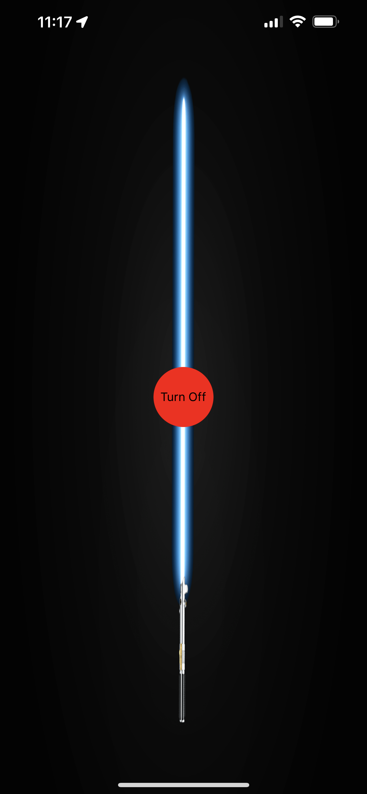

# LightSaberApp
An app designed to simulate a lightsaber with a phone's accelerometer and lightsaber sounds. Built with React Native and Expo.
## 📅 Goals:
- Implementing sensors of a phone in an app (accelerometer)
- Playing audio files after certain events
- Practice lightsaber skills

## 📷 Preview

## 💡 Functionality
The lightsaber has four different events with their respective sounds. 

1. Turning on the lightsaber
2. Turning off the lightsaber
3. Swinging the lightsaber
4. "Crashing" the lightsaber
